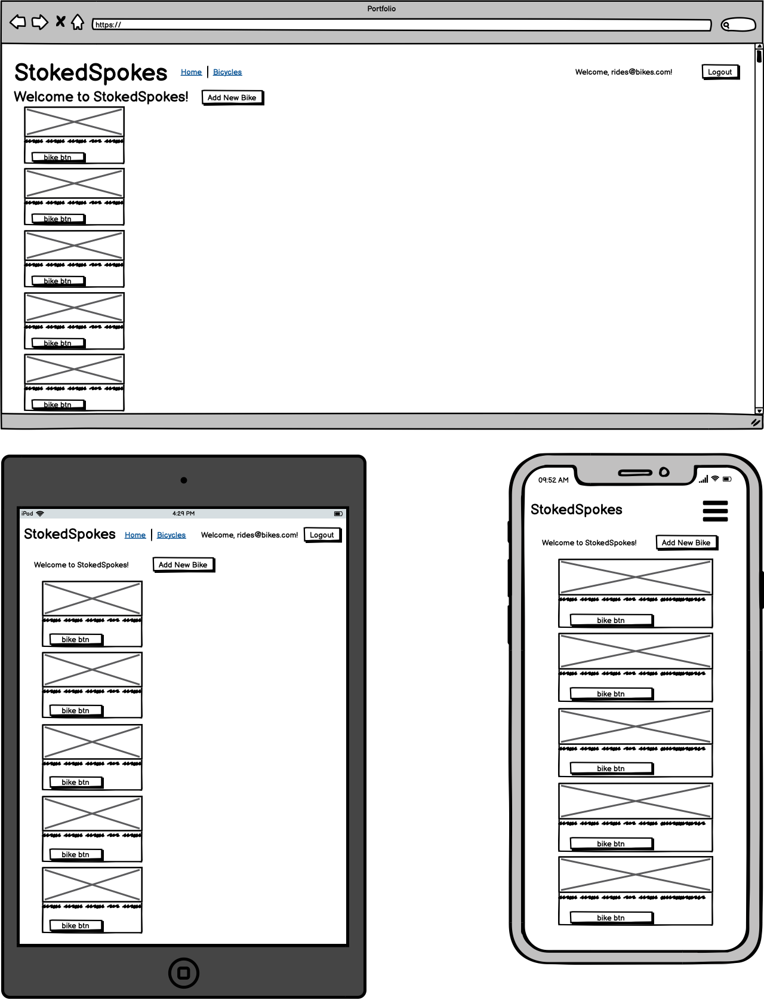
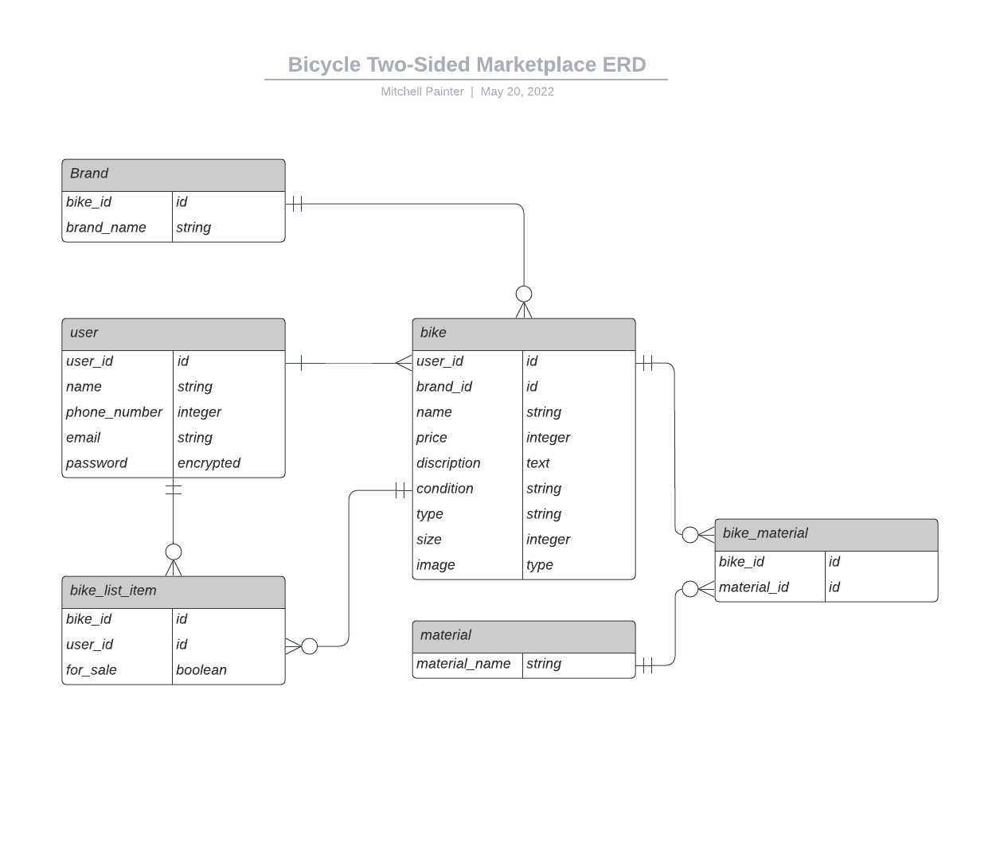

# StokedSpokes

#### R7
Three key problems have been a main focus and consideration in the development and production of this application. To fill a gap in the market as there is no such two-sided marketplace mainly focused on the sale and purchase of bicycles, to bring the cycling community together and provide an enjoyable and secure platform for enthusiasts and cyclists of all kinds to sell and purchase their used bicycles, and to assist in solving the issue of landfill and other important environmental factors by upcycling used bicycles and giving them new life. The goal here was to assist in solving these problems by developing and implementing a one-stop-shop application that covers everything used bicycles. 

#### R8
I would consider all of the aforementioned problems, ones that need solving, however, the main goal was to provide an easy and enjoyable to use two-sided marketplace with a simple design and a focus on a strong user experience, where users can sell or purchase their used bicycles while avoiding the saturated market of marketplaces we see every day that allows the users to sell any items without a key focus or product. With a key focus on only bicycles as the main product, we can clearly and simply display the range of used bicycles on offer within the StokedSpokes and cycling community while avoiding the distraction and tediousness of filtering or searching through many unrelated sales products as seen in many other marketplace environments. This also encourages and assists the cycling community to keep informed on the market value of their bicycles and the general interest there may be for similar products.

#### R9
#### Deployed App Link:
https://desolate-mountain-51945.herokuapp.com/

#### R10
#### GitHub Repository:
https://github.com/mitchpaint11/stokedspokes

#### R11
### Discription:
This marketplace app has been built for the purpose of buying and selling used bicycles. The main goal was to provide an easy and enjoyable to use two-sided marketplace with a simple design and a focus on a strong user experience. It is a two-sided marketplace with a target audience of cyclists and enthusiasts, where the user could be signed up and logged in as either a seller or a buyer. When logged in as a seller, the user is given authorisation and access to the app with the ability to view, add, edit, and delete bikes. Within the add view, a seller has the ability to add a used bike for sale and is given the opportunity to fill out the given fields to provide as much detail as possible for the buyer to make an informed decision. These fields include; Name, Price, Brand, Condition, Bike Type, Size(cm), Material, and Description, with the added benefit of image uploading capabilities, to help display the given bicycle or product. The edit view, allows the seller to access and edit the aforementioned description fields to maintain and provide the most up to date information. When logged in as a buyer, the user is given the authorisation and access to view all bicycles that are on the platform for sale as well as any related descriptive information and pricing details, however, does not have the authorisation to add, edit or delete a bicycle.

There are some features or functionality that could be added to make this app more efficient, however, at this stage of the development process, it is kept simple to cover the functionality specifications outlined and still provide an efficient, easy and enjoyable to use application for the world of two-sided marketplaces and the cycling community

### SiteMap:

### ScreenShots:

#### Index:

#### Show:

#### Signup:

#### Login:

#### New:

#### Seller-logged-in:

#### Edit:

#### Iphone New/Show:
 

### Tech Stack
-   Ruby
-   Ruby on Rails
-   CSS - Bootstrap
-   HTML
-   JavaScript
-   Deployment: Heroku

#### R12
### User Stories!

"As a seller of a used bicycle, I need a marketplace App to show my product to potential customers, so I can sell my bicycle."

"As a seller, I need the ability to add a bicycle for sale and add its related details, including description, price, brand, material, etc."

"As a seller, I need the ability to EDIT details, so I can make changes to an existing product."

"As a Customer, I need a marketplace App to view a range of used bicycles for sale, so I can select and purchase one."

"As a User, I need the ability to make an account and login/out, so I can keep my information safe."

[Trello/UserStories](https://trello.com/b/4OCG9ZzS/marketplace-application).

#### R13
### Wireframes:

#### R14
### ERD:

#### R15
There are six high-level components or abstractions that make up this application, and the relationships they have with one another are extremely important. These components consist of many attributes that assist this PostgreSQL relational database in defining its functions and achieving the desired outcomes. These components are as follows,

-   Bike: As bicycles are the main product and focus of this application, the bike model is one of the most important. The bike model consists of many attributes such as user_id, brand_id, name, price, description, condition, type, size and image, which all assist in controlling how the bicycle information is displayed to the user. The bike model has its own controller, called bikes_controller, where the CRUD specifics and their required functions and parameters are defined. These include, index, show, new, create, edit, update, destroy, and authorisation checks. 
  
-   User: As this is a two-sided marketplace there are two types of users, a seller and a buyer, these users are defined by the attributes outlined in the user model. These attributes include user_id, name, email, and password. This user model also assists in providing different roles to certain users which in the case of this application is a seller or admin role with full authorisation and access to all capabilities, and the buyer role, with access to the index and show views with limited capabilities.

-   Brand: To assist in the simplicity and ease of use, the brand was implemented as its own model to assist in providing and displaying bicycle brands for the user to choose from in the new and edit bike form as a drop-down options tab. Brand consists of the bike_id and brand_name attributes.

-   Material: Similar to brand, material was implemented as its own model to assist in providing and displaying bicycle materials for the user to choose from in the new and edit bike form as a drop-down options tab. Material consists of the material_name attribute and is linked to the bike model with the use of a join table called bike_material. The bike_material model consists of the attributes bike_id and material_id which in conjunction with the material model assists in categorising different bikes based on their material.

#### R16
This application utilises the third party services of Cloudinary and Heroku. Cloudinary is a provider of cloud-based image and video management services. It enables users to upload, store, manage, manipulate, and deliver images and videos for websites and apps. Cloudinary has been utilised within this application to implement the image uploading capabilities provided, allowing a seller to upload an image of their bicycle to assist them in encouraging buyers. Heroku is a cloud platform service and has been utilised within this application as a means for deployment. please see the Heroku deployed app [here](https://desolate-mountain-51945.herokuapp.com/).

#### R17
When it comes to this application's models in terms of the relationships and active record associations they have with each other, this is how they function. 
-   Bike belongs_to brand, this means that the given bike belongs to the brand that is specified as far as the active record is concerned, there can be many brands, however, each bike will belong to one brand. Bike has_many bike_materials, meaning that for each bike there are many possible materials that particular bike could be categorised in, in the case of this application, there are three different materials, Carbon, Alloy, and Steel. Bike also has_many materials through bike_materials, meaning materials are linked to bike through the use of a join table called bike_materials. This allows material to be a model of its own to assist in further differentiating and specifying different bicycles. Bike has_one_atttached image, which means for each time @bike is called there could be an image attached. 

-   Brand has_many bikes, this means that for each specified brand there could be multiple bikes listed within the application that falls under the same brand_id. However, one bike can only have one brand, hence why, as stated above "bike belongs_to_brand".

-   Bike_material belongs_to bike, this means that any given bike_material belongs to the bike that is specified as far as the active record is concerned, there can be many bikes and there can be many bike materials, however, bike_material belongs_to bike. Bike_material also belongs_to material meaning that bike_material is used as a join table for the active record to join material with bike, a join table is used due to the many_to_many relationship that is present between bike and material.

-   Material has_many bike_materials and has_many bikes, through bike_materials. This means that for each specified material there could be multiple bike_materials listed within the application that falls under the same material_id.

#### R18
As displayed in the ERD above, there are four main entities and two join tables that make up the relational database that has been implemented within this application. The four main entities are user, bike, brand, and material and the two join tables are bike_material and bike_list_item. 

-   User has a one-to-many relationship with bike, and, a one-and only-one to a zero-to-many relationship with bike_list_item.
-   Bike has a one-and-only-one to a zero-to-many relationship with bike_list_item, and, a one-and-only-one to a zero-to-many relationship with bike_material.
-   Material has a one-and-only-one to a zero-to-many relationship with bike_material, which has a many-or-zero to a one-and-only-one relationship with bike.
-   Brand has a one-and-only-one to a zero-to-many relationship with bike

#### R19
Please see (R14) to review my ERD that will provide my schema design.

#### R20
Tasks were allocated and tracked throughout this project through the use of a Trello board. All aspects of the application project were broken down into individual tasks and placed into either the to-do, doing, or done lists in order to provide deadlines and assist in achieving set goals. A simple outline of the design goal was placed in the design list, and the application user stories were written and kept in the backlog list within the Trello board. Please see the link to my Trello board [here](https://trello.com/b/4OCG9ZzS/marketplace-application).