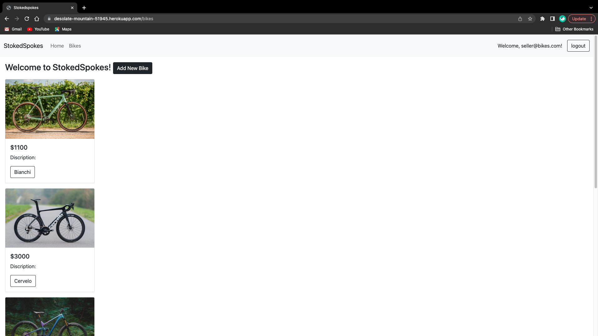
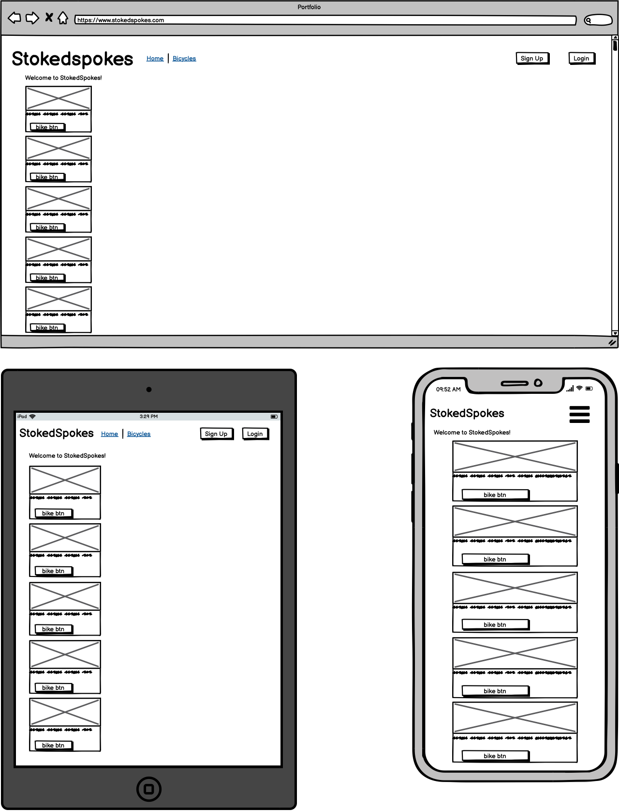

# StokedSpokes

#### R7

#### R8

#### R9
#### Deployed App Link:
https://desolate-mountain-51945.herokuapp.com/

#### R10
#### GitHub Repository:
https://github.com/mitchpaint11/stokedspokes

#### R11
### Discription:
This marketplace app has been built for the purpose of buying and selling used bicycles. It is a two-sided marketplace with a target audience of bicycle riders and enthusiasts, where the user could be signed up and logged in as either a seller or a buyer. When logged in as a seller, the user is given authorisation and access to the app with the ability to view, add, edit, and delete bikes. Within the add view, a seller has the ability to add a used bike for sale, and given the oportunity to fill out the given fields in order to provide as much detail as possible for the buyer. These fields include; Name, Price, Brand, Condition, Bike type, Size(cm), Material, and Discription, with the added benefit of image uploading capabilities, to help display the given bicycle or product. The edit view, allows the seller to access and edit the aforementioned discription fields in order to maintain and provide the most up to date information. When logged in as a buyer, the user is given the authorisation and access to view any and all bicycles for sale that have been supplied by sellers, however, does not have the authorisation to add, edit or delete a bicycle.

### SiteMap:

### ScreenShots:

#### Index:

#### Show:

#### Signup:

#### Login:

#### New:

#### Seller-logged-in:

#### Edit:

#### Iphone New/Show:
 

### Tech Stack
-   Ruby
-   Ruby on Rails
-   CSS - Bootstrap
-   HTML
-   JavaScript
-   Deployment: Heroku

#### R12
### User Stories!

"As a seller of a used bicycle, I need a marketplace App to show my product to potential customers, so I can sell my bicycle."

"As a seller, I need the ability to add a bicycle for sale and add its related details, including description, price, brand, material, etc."

"As a seller, I need the ability to EDIT details, so I can make changes to an existing product."

"As a Customer, I need a marketplace App to view a range of used bicycles for sale, so I can select and purchase one."

"As a User, I need the ability to make an account and login/out, so I can keep my information safe."

https://trello.com/b/4OCG9ZzS/marketplace-application

#### R13
### Wireframes:

#### R14
### ERD:

#### R15

#### R16

#### R17

#### R18

#### R19

#### R20